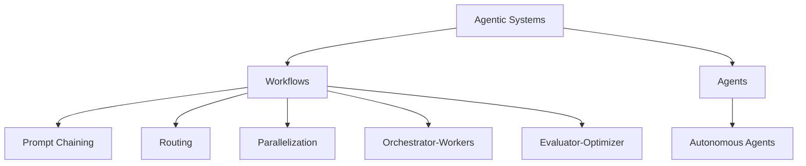

# Building Effective Agents（Anthropic要約）

## 概要
Anthropic社の「Building effective agents」記事の要点をまとめたノート。LLMエージェント設計の基本原則・パターン・実践例・ツール設計のベストプラクティスを整理。

---

## 1. エージェントとは何か・Agentic Systemsの分類

Anthropic社の記事では、エージェント的システム（Agentic Systems）は以下のように分類される：

- **ワークフロー型（Workflows）**：
    - LLMやツールを「決められたコードパス（手順）」でオーケストレーションする。
    - 例：プロンプトチェーン、ルーティング、並列化など。
    - 予測可能性・一貫性が高い。
- **エージェント型（Agents）**：
    - LLMが自律的にプロセスやツール利用を動的に決定し、タスク達成まで自分で進める。
    - 柔軟な意思決定・計画・環境からのフィードバックを活用。
    - 予測困難なタスクや複雑な意思決定に強み。

### Agentic Systemsの分類（Mermaid図）

#### 解説
- **Workflows**は「決められた道筋」でLLMやツールを組み合わせる。
- **Agents**は「自律的な意思決定・計画・実行」を特徴とし、タスクごとに最適な手順やツール利用を自分で選ぶ。

---

## 2. いつエージェントを使うべきか
- まずは単純な解決策から。複雑なタスクや柔軟な意思決定が必要な場合にエージェント化。
- 単純なLLM API呼び出しやプロンプトチェーンで十分な場合も多い。

## 3. エージェント構築のパターン
### 基本ブロック
- 拡張LLM（検索・ツール利用・メモリ等）

### 代表的なワークフロー

| ワークフロー名              | 概要                                                                 | 代表的ユースケース例                                                                 |
|-----------------------------|----------------------------------------------------------------------|--------------------------------------------------------------------------------------|
| プロンプトチェーン          | タスクを複数のサブタスクに分割し、段階的にLLMを呼び出す。            | ・マーケティング文の生成→翻訳   ・アウトライン作成→チェック→本文生成              |
| ルーティング                | 入力を分類し、最適なプロンプトやツール、モデルに振り分ける。         | ・問い合わせ種別ごとに処理分岐   ・簡単な質問は軽量モデル、難問は高性能モデルへ   |
| 並列化（セクショニング/投票）| 複数のLLM呼び出しを同時実行し、結果を集約。 セクショニング：独立したサブタスクを並列処理 投票：同一タスクを複数回実行し多様な出力を得る | ・ガードレール（応答と安全性判定を並列） ・複数観点でのコードレビューや評価         |
| オーケストレータ-ワーカー   | 中央LLMがタスクを動的に分割し、ワーカーLLMに割り振る。               | ・複数ファイルの同時編集が必要なコーディング ・多段階の情報収集・分析タスク         |
| 評価者-最適化ループ         | LLMが出力し、別のLLMが評価・フィードバックを繰り返す。                | ・文芸翻訳の品質向上 ・複数回の検索・分析で網羅的な情報収集                     |

### エージェント
- 指示や対話を受けて計画・実行・フィードバックを自律的に繰り返す
- 環境からのフィードバックを逐次取得し進捗を自己評価
- コストやエラー蓄積リスクがあるためガードレール設計が重要

## 4. フレームワーク利用の注意
- LangGraph, Bedrock, Rivet, Vellum等のフレームワークは導入容易だが、抽象化が進みすぎるとデバッグや理解が難しくなる
- まずはLLM APIを直接使い、必要に応じてフレームワーク活用が推奨

## 5. 実践例
- カスタマーサポート：会話＋外部データ参照＋アクションを組み合わせたエージェント
- コーディングエージェント：自動テストやフィードバックループを活用し複雑なコード修正も自律的に実行

## 6. ツール設計のベストプラクティス
- モデルが直感的に使えるようパラメータや説明を工夫（例：絶対パス指定、例示、エッジケース明記）
- フォーマットは自然言語や一般的なコード例に近づける
- テストと改善を繰り返し、ミスを減らす設計（ポカヨケ）を意識

## 7. まとめ・原則
- シンプルな設計を維持
- 透明性（エージェントの計画や判断過程を明示）
- エージェント-コンピュータ・インターフェース（ACI）の設計とテストに注力

---

## 参考リンク
- [Anthropic Cookbook: Agents](https://github.com/anthropics/anthropic-cookbook/tree/main/patterns/agents)
- [Model Context Protocol](https://www.anthropic.com/news/model-context-protocol)

#生成AI #ai/agents #ai/llm #設計パターン #anthropic
