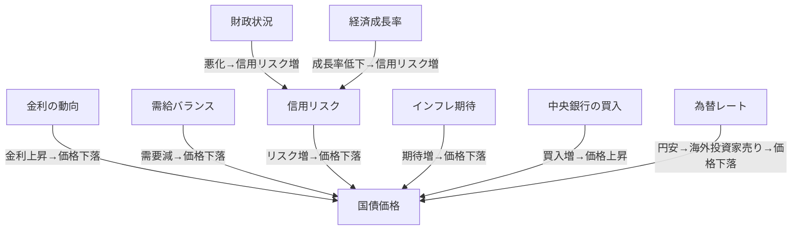

# 国債価格を変動させる要因

国債価格は様々な要因によって変動します。以下に主な要因を整理し、Mermaid記法の因果関係図で可視化します。

## 概要
国債価格は「需給バランス」「金利動向」「信用リスク」「インフレ期待」「中央銀行の政策」など複数の要素が複雑に絡み合って決まります。これらの要因は相互に影響し合い、時に市場のセンチメントや外部ショックによっても大きく変動します。

## Mermaid 図

## Mermaid図の内容説明

上記のMermaid図は、国債価格に影響を与える主な要因と、それらの因果関係を視覚的に示しています。

- 「金利の動向」は、金利が上昇すると既発国債の価格が下落するという基本的な逆相関を表します。
- 「需給バランス」は、国債の需要が減少した場合に価格が下落することを示しています。
- 「信用リスク」は、財政状況や経済成長率の悪化によって高まると、国債価格が下落する要因となります。
- 「インフレ期待」は、インフレ率の上昇が見込まれると、実質利回りの低下を嫌気して国債価格が下がることを示します。
- 「中央銀行の買入」は、日銀などが国債を大量に買い入れることで価格が上昇する効果を持つことを表現しています。
- 「為替レート」は、円安が進むと海外投資家の売りが増え、国債価格が下落しやすくなることを示しています。
- 「財政状況」や「経済成長率」は、直接「信用リスク」に影響し、間接的に国債価格に波及します。

このように、国債価格は単一の要因ではなく、複数の経済・金融要因が複雑に絡み合って決定されることがMermaid図から読み取れます。

## 補足解説
- 金利が上昇すると、既発国債の魅力が相対的に低下し価格が下がる。
- 需給バランスは、発行量増加や投資家の需要減少で価格下落要因となる。
- 信用リスク（財政悪化や経済低迷）は国債価格を押し下げる。
- インフレ期待が高まると、実質利回り低下を嫌気して価格が下がる。
- 中央銀行の大量買入は価格を下支えする。
- 為替レートや海外投資家の動向も影響。

## タグ
#国債 #金融市場 #財政政策
