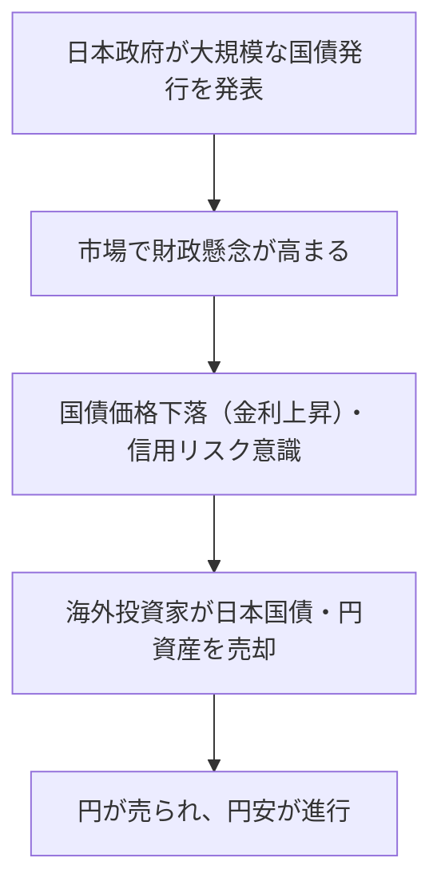

# 国債発行量増加と円安進行の関係

## 概要
国債発行量が増加すると、なぜ円安が進行しやすくなるのか。そのメカニズムを経済学・金融市場の観点から整理し、反証や異論も含めて考察する。

## 基本的なメカニズム
- 国債発行量の増加は、政府の財政赤字拡大や将来の財政不安を市場に意識させる。
- 投資家は日本国債の信用リスク上昇や将来的なインフレ懸念を感じ、国債の売却や新規購入を控える動きが出る。
- 国債が売られると、円建て資産から資金が流出し、円が売られる（＝円安が進む）圧力が高まる。
- 特に海外投資家は、為替リスクや信用リスクを嫌って円建て資産を減らす傾向が強く、円安に拍車をかける。

### 具体的な流れ（例）

1. 日本政府が大規模な国債発行を発表
2. 市場で「日本の財政は大丈夫か？」という懸念が高まる
3. 国債価格が下落（金利上昇）、信用リスクが意識される
4. 海外投資家が日本国債や円資産を売却
5. 円が売られ、円安が進行

## 反証・異論となる視点
- 日本は自国通貨建てで国債を発行しているため、理論上はデフォルトリスクが低い（中央銀行が通貨発行できる）。
- 日銀など中央銀行が国債を大量に買い入れる場合、金利上昇や円安圧力が抑制されることもある。
- 世界的なリスクオフ局面では、逆に「安全資産」として円が買われる（円高）こともある。

## 関連ノート・リンク
- [[日銀の国債買入と金融政策の限界]]
- [[日本の国債_発行理由_購入者_動機_歴史的変遷]]
- [[高齢化社会と国債リスクの将来シナリオ]]
- [[国債価格を変動させる要因]]

## 新規Zettel題材案
- 国債発行量増加と為替レートの関係
- 財政リスクと通貨価値の理論・実証
- 中央銀行の国債買入が為替に与える影響

## タグ
#国債 #為替 #金融市場 #財政リスク #円安

[//begin]: # "Autogenerated link references for markdown compatibility"
[日銀の国債買入と金融政策の限界]: %E6%97%A5%E9%8A%80%E3%81%AE%E5%9B%BD%E5%82%B5%E8%B2%B7%E5%85%A5%E3%81%A8%E9%87%91%E8%9E%8D%E6%94%BF%E7%AD%96%E3%81%AE%E9%99%90%E7%95%8C.md "日銀の国債買入と金融政策の限界"
[日本の国債_発行理由_購入者_動機_歴史的変遷]: %E6%97%A5%E6%9C%AC%E3%81%AE%E5%9B%BD%E5%82%B5_%E7%99%BA%E8%A1%8C%E7%90%86%E7%94%B1_%E8%B3%BC%E5%85%A5%E8%80%85_%E5%8B%95%E6%A9%9F_%E6%AD%B4%E5%8F%B2%E7%9A%84%E5%A4%89%E9%81%B7.md "日本における国債の発行理由・購入者・購入動機と歴史的変遷"
[高齢化社会と国債リスクの将来シナリオ]: %E9%AB%98%E9%BD%A2%E5%8C%96%E7%A4%BE%E4%BC%9A%E3%81%A8%E5%9B%BD%E5%82%B5%E3%83%AA%E3%82%B9%E3%82%AF%E3%81%AE%E5%B0%86%E6%9D%A5%E3%82%B7%E3%83%8A%E3%83%AA%E3%82%AA.md "高齢化社会と国債リスクの将来シナリオ"
[国債価格を変動させる要因]: %E5%9B%BD%E5%82%B5%E4%BE%A1%E6%A0%BC%E3%82%92%E5%A4%89%E5%8B%95%E3%81%95%E3%81%9B%E3%82%8B%E8%A6%81%E5%9B%A0.md "国債価格を変動させる要因"
[//end]: # "Autogenerated link references"
