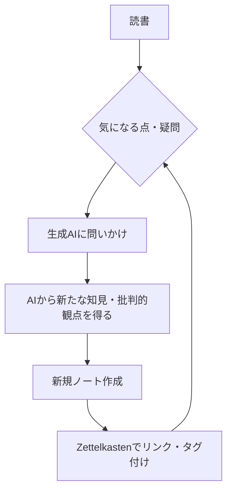

# Zettelkasten×生成AI対話で深まる読書──知識の定着と外部化の実践

## 1. はじめに

読書を「知識の定着」や「思考の外部化」にどうつなげるかは、多くの知的生産者にとって重要なテーマです。従来の読書法──たとえば色付けや下線引き、再読──は受動的な学習にとどまり、知識の定着や応用には限界があります。

[[ノートの取り方_手書きvsパソコン]]や[[受動的学習と能動的学習_KarpickeとZettelkastenの意義]]でも触れたように、能動的な学習法が求められています。

### Zettelkastenとは

Zettelkasten（ツェッテルカステン）は、ドイツ語で「カード箱」を意味し、知識やアイデアを小さなノート（Zettel）として分割・記録し、それらを相互にリンクすることで知識のネットワークを構築する手法です。各ノートは一つの考えや事実にフォーカスし、他のノートと関連付けることで、思考の発展や新たな発見を促します。Zettelkastenは、単なるメモの集積ではなく、ノート同士の関係性を重視することで、知識の外部化と再利用性を高める知的生産のためのシステムです。

本記事では、Zettelkastenと生成AI（例：ChatGPTやClaudeなど）を組み合わせることで、読書体験がどのように深化し、知識のネットワーク化や批判的思考の促進につながるかを考察します。

## 2. 受動的学習の限界と能動的学習の重要性

- [[受動的学習と能動的学習_KarpickeとZettelkastenの意義]]を参照しつつ、色付けや下線引き、再読だけでは知識が定着しにくいことを解説。
- Karpickeらの研究や実体験を交え、「自分の言葉で再構成・アウトプット」することの意義を述べる。
- 受動的学習から能動的学習への転換が、知識の深い定着と応用力の向上に不可欠であることを強調。

## 3. Zettelkastenによる知識のネットワーク化

- [[解釈学的循環]]の「部分と全体の往復」や「先入観の活用」になぞらえ、Zettelkastenでノートをリンクしながら知識を再解釈・再構成するプロセスを紹介。
- 「Connecting the dots」的な発想の広がりも言及。
- ノート同士のリンクやタグ付けによって、知識が孤立せずネットワークとして発展することを説明。

## 4. 生成AIとの対話による思考の深化と批判的観点

- 読書内容やノートについて生成AIと議論することで、曖昧な理解や思い込みが明確化される。
- [[議事録作成と能動的学習]]のように、AIとの対話自体が「能動的な再構成」や「新たな発見」につながることを具体例で示す。
- 特に、AIに「反証的な観点」や「異論となる視点」を意識的に問いかけることで、確証バイアスを回避し、より多面的な理解が得られる。
- カーネマンの指摘する「脳は結論に飛びつく機械」という性質も、批判的思考や反証的視点の重要性を裏付けている。人間は直感的・省エネ的に判断しがちであり、意識的に異論や反証を検討することで、思い込みやバイアスを回避できる。
- なお、この批判的観点の導入は、Zettelkasten運用指針（copilot-instructions.md）にも明記している。

## 5. 実践ワークフロー：読書から知識ネットワークへ

- 読書中に気になった点や疑問をその場で生成AIに問いかける。
- AIとの対話で得た新たな知見や批判的観点を新規ノートとして追加。
- こうしたノートをZettelkastenでリンク・タグ付けし、知識ネットワークを拡張する。
- このワークフローは、Zettelkasten運用指針（copilot-instructions.md）にも明記されている「反証・異論の視点を意識的に検討・記述する」実践例である。

### ワークフロー図

## 6. ノート設計・タグ付けTips

- Zettelkastenノートとして知識を外部化することで、後から再利用・再解釈が容易になる。
- タグ付けやリンク設計のコツ、タグルール（copilot-instructions.md参照）を簡潔にまとめる。
- ノート同士のリンクやタグ付けの工夫によって、知識のネットワークがより強固になる。

## 7. おわりに

Zettelkastenと生成AIの組み合わせは、知識の定着・発展・外部化を加速する強力な知的生産ツールである。特に、AIとの対話で批判的観点を意識的に取り入れることで、確証バイアスを回避し、より深い学びと発想の広がりが得られる。今後の展望として、読者自身がこのワークフローを実践し、自分なりの知識ネットワークを構築していくことを強く推奨したい。

---

### 参考ノート
- [[受動的学習と能動的学習_KarpickeとZettelkastenの意義]]
- [[議事録作成と能動的学習]]
- [[解釈学的循環]]
- [[Take Notes]]

---

#zettelkasten #生成AI #知的生産 #アウトプット重視 #読書術 #blog
